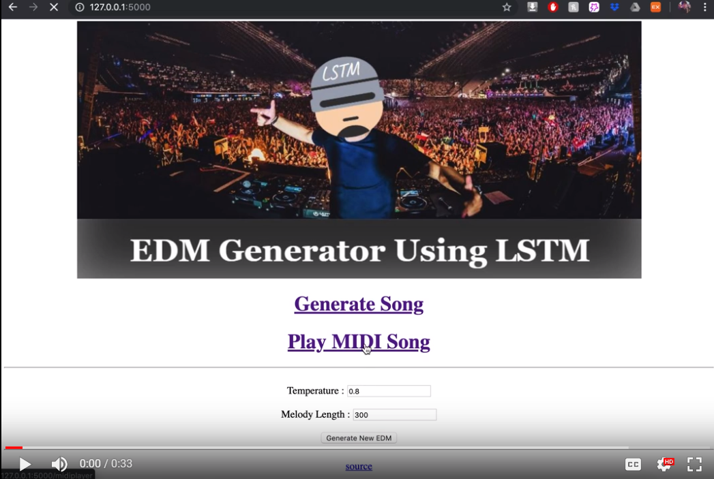
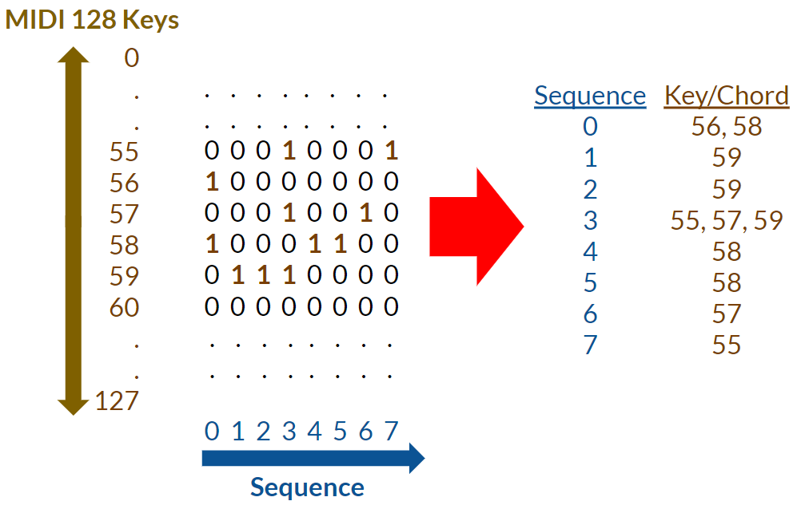
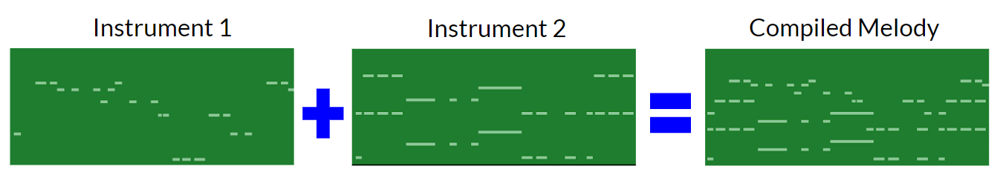
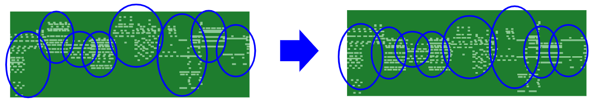
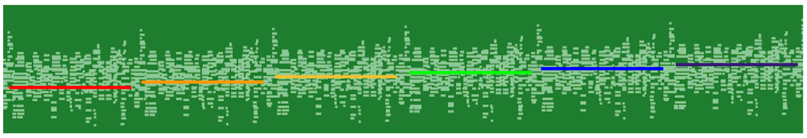

# EDM Generator Using LSTM
In this project, I trained **LSTM models** to generate melody and percussion, which are then combined to generate **EDM music** with sprinkles of **Classical music**. Then, **nueral network classifier** was built to gauge output from LSTM models. Finally, **interactive Flask app** was built to utilize pretrained models to easily generate and play songs.

## Project Intro/Objective
I went to EDM concert for the first time in August 2019. Then, I wanted to generate my own **endless** EDM music, and this was done by infusing Classical music into it. Besides being unique, adding Classical music was very advantageous to overall flow and this will be discussed in "Feature Engineering" section. Also, **MIDI file format** was used for dataset, which means that instruments for generated melody and percussions can be altered very easily.

[Presentation Link - Google Slides](https://docs.google.com/presentation/d/1zXZ93rWshsaOpxh_lYr6b3dzsdWjL1Ek0-7hRlvWi_o/edit)  
[Presentation Link - Live](https://youtu.be/gTKVusBObZc)  
[Flask Demo](https://www.youtube.com/watch?v=-h8f86n0Ho0)

## Dataset Used
MIDI (Musical Instrument Digital Interface) file format was utilized in this project for data type of training set. First of many big advantages of MIDI format is that it is very **lightweight**, therefore very **scalable**. MIDI format is 0.05% in size compared to .wave format to represent similar length of sound. Also, because it is very lightweight, it is the perfect data type for Flask app in which EDM music is very quickly generated and played. Secondly, user can play generated melody and percussion with **ANY** type of instrument using MIDI player. Lastly and most importantly, chords/notes are represented as 128 vectors in MIDI file format. This allowed very efficient and effective feature engineering process. Also, **vector representaion** of notes were key component of allowing LSTM models to generate very fluidic and pleasant melodies and percussions. Below is a visual explaining vector representation of chords/notes.  

Besides making genearted music sound interesting by infusing Classical music into EDM music, it was also a strategic move. Melodies, or patterns, from EDM songs are very **catchy** and **simple**, but they tend to be very **distinct** from each other across different EDM songs. Because of this, LSTM model will be generate patterns that doesn't have smooth transitions. On the other hand, Classical music has **complex** but very **fluidic** patterns. Therefore, patterns from Classical music will act as linkage or bridge between distinct patterns of EDM music. At the end, generated EDM music will sound coherent without sounding like a random collection of different patterns of EDM songs.

## Methods Used
* AWS **(GPU-enabled cloud trainig)**
* Data Preprocessing
* Feature Engineering
* etc.

## Notable Technologies Used
* Python 3, Jupyter Notebook
* Pypianoroll, Music21 **(MIDI file format encoder/decoder/player)**
* Pandas, Numpy, Matplotlib, Seaborn **(Data Processing/Visualization tools)**
* TensorFlow, Keras, Scikit-learn **(LSTM and Neural Network Models)**
* Flask **(Demo generation)**
* etc. 

## Feature Engineering
As explained in "Dataset Used" section, adding Classical music into the training data can be treated as a feature engineering since ultimate goal of this project is to generate new EDM music that is not just replicas of training data while having a smooth mix of patterns from training dataset. Intent of adding Classical music was to create a fluidic EDM music, and following feature engineering was done to maximize this effect.

**Firstly,** different instruments that carries melodies within same song were added together. By **adding vectors of different instruments**, I was able to generate just one vector that carried all melodies/patterns per song without having to throw away any information to comply with rigid input shape of LSTM architecture.

**Secondly,** entire **vector spaces were shifted on song level** so that each songs in the training set are aligned so that they had the same mean center note. Because entire keys were shifted in song level, it didn't compromise how each song sounded like while forcing all songs to be in similar key range. This preprocessing was very important because it paved a way for LSTM model to easily jump and grab different patterns when it is generating a new EDM music.  

**Thirdly,** after instruments are added together and songs are aligned, **entire collection of songs were shifted**, or transposed, to generate more patterns that LSTM model can take advantage of when generating new patterns.  

## Model 

## Result 

## Conclusion

