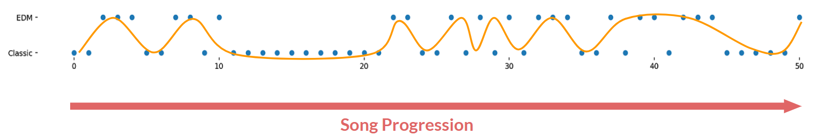

# EDM Generator Using LSTM
In this project, I trained **LSTM models** to generate melody and percussion, which are then combined to generate **EDM music** with sprinkles of **Classical music**. Then, **nueral network classifier** was built to gauge output from LSTM models. Finally, **interactive Flask app** was built to utilize pretrained models to easily generate and play songs.

## Project Intro/Objective
I went to EDM concert for the first time in August 2019. Then, I wanted to generate my own **endless** EDM music, and this was done by infusing Classical music into it. Besides being unique, adding Classical music was very advantageous to overall flow and this will be discussed in "Feature Engineering" section. Also, **MIDI file format** was used for dataset, which means that instruments for generated melody and percussions can be altered very easily.

[Presentation Link - Google Slides](https://docs.google.com/presentation/d/1zXZ93rWshsaOpxh_lYr6b3dzsdWjL1Ek0-7hRlvWi_o/edit)  
[Presentation Link - Live](https://youtu.be/gTKVusBObZc)  
[Flask Demo](https://www.youtube.com/watch?v=-h8f86n0Ho0)

## Dataset Used
MIDI (Musical Instrument Digital Interface) file format was utilized in this project for data type of training set. First of many big advantages of MIDI format is that it is very **lightweight**, therefore very **scalable**. MIDI format is 0.05% in size compared to .wave format to represent similar length of sound. Also, because it is very lightweight, it is the perfect data type for Flask app in which EDM music is very quickly generated and played. Secondly, user can play generated melody and percussion with **ANY** type of instrument using MIDI player. Lastly and most importantly, chords/notes are represented as 128 vectors in MIDI file format. This allowed very efficient and effective feature engineering process. Also, **vector representaion** of notes were key component of allowing LSTM models to generate very fluidic and pleasant melodies and percussions. Below is a visual explaining vector representation of chords/notes.  

Besides making genearted music sound interesting by infusing Classical music into EDM music, it was also a strategic move. Melodies, or patterns, from EDM songs are very **catchy** and **simple**, but they tend to be very **distinct** from each other across different EDM songs. Because of this, LSTM model will be generate patterns that doesn't have smooth transitions. On the other hand, Classical music has **complex** but very **fluidic** patterns. Therefore, patterns from Classical music will act as linkage or bridge between distinct patterns of EDM music. At the end, generated EDM music will sound coherent without sounding like a random collection of different patterns of EDM songs.

## Methods Used
* AWS **(GPU-enabled cloud trainig)**
* Data Preprocessing
* Feature Engineering
* etc.

## [Link to Blog](https://silvernine209.github.io/matthewlee.github.io/)

## Notable Technologies Used
* Python 3, Jupyter Notebook
* Pypianoroll, Music21 **(MIDI file format encoder/decoder/player)**
* Pandas, Numpy, Matplotlib, Seaborn **(Data Processing/Visualization tools)**
* TensorFlow, Keras, Scikit-learn **(LSTM and Neural Network Models)**
* Flask **(Demo generation)**
* etc. 

## Feature Engineering
As explained in "Dataset Used" section, adding Classical music into the training data can be treated as a feature engineering since ultimate goal of this project is to generate new EDM music that is not just replicas of training data while having a smooth mix of patterns from training dataset. Intent of adding Classical music was to create a fluidic EDM music, and following feature engineering was done to maximize this effect.

**Firstly,** different instruments that carries melodies within same song were added together. By **adding vectors of different instruments**, I was able to generate just one vector that carried all melodies/patterns per song without having to throw away any information to comply with rigid input shape of LSTM architecture.

**Secondly,** entire **vector spaces were shifted on song level** so that each songs in the training set are aligned so that they had the same mean center note. Because entire keys were shifted in song level, it didn't compromise how each song sounded like while forcing all songs to be in similar key range. This preprocessing was very important because it paved a way for LSTM model to easily jump and grab different patterns when it is generating a new EDM music.  

**Thirdly,** after instruments are added together and songs are aligned, **entire collection of songs were shifted**, or transposed, to generate more patterns that LSTM model can take advantage of when generating new patterns.  

Upshot of feature engineering mentioned above is to generate more patterns that share similar key range so that LSTM model can generate new fluidic and unique patterns.

## Model 
Below are three models that play integral part in this project.  
* **LSTM Model for Melody Generation,**
* **LSTM Model for Percussion Generation**
* **Neural Network Classifier to Monitor LSTM Model's Performance**

For each song, vector spaces were divided into melody and percussion parts to develop two LSTM models. LSTM models were independent of each other and this was totally okay since percussions weren't really dependent on melodies. As long as generated melodies and percussions were on the same tempo, coherent EDM song was created when the two were combined.

LSTM models were trained on multiple **AWS GPU-enabled instances** for speed. **Iterative training process** with different number of sequences were used to predict the next sequence of melody and percussion. After testing from using 3 sequences to 150 sequences to predict the next sequence, using sequence number of 3 yielded the best result. Also, there were no validation or test dataset and each of the two LSTM models were **intentionally overfit** to the training data of melody and percussion. This was a sound approach since **probabilistic sampling of predictions** was used to vary the outcome.

Finally, neural network classifier was built to classify different segments of generated song as either EDM or Classic. Besides simply listening to generated music and evaluating what has been generated, neural network classifier allowed more systematic and visual assessment of generated songs.

## Result 
Below is an example of classification performed by neural network classifier. As song is being played out from left to right, it is clear that generated song is a good mix of EDM and Classical components.  
* [Play Classified Song](https://drive.google.com/open?id=1UuOAGYp6jM4kzl5Bwxwe8kgzn47m7LW0)  

Here are three more examples of generated song that I liked! I will let these songs to speak themselves for how I was able to generate new EDM songs with success.  
* [Play Example 1](https://drive.google.com/open?id=1IPOVDD_DdFx_EbKt2TdHw0siy1R73kUl)  
* [Play Example 2](https://drive.google.com/open?id=1Wic2VTTiVIWFuwgUQLvyHcZFsE4tRdYI)   

Again, here is link to an interactive Flask app that allows user to generate and play EDM music very easily while giving the option of changing instruments on the fly.  
[Flask Demo](https://www.youtube.com/watch?v=-h8f86n0Ho0)

## Conclusion
Pipeline built in this project is very reliable and robust. With the same pipeline, genre of music for the MIDI files can be changed to anything else to yield equally good results. Also, models and pipeline built in this project are very lightweight, and I look forward to possibility of developing a mobile app. In this app, user can choose any collection of MIDI files to generate a song that is a smooth mixture of input songs. In follow-up project, I would like to explore pitch-tracking of user's hums as input melodies to generate new songs based on the melody from hum.

## [Link to Blog](https://silvernine209.github.io/matthewlee.github.io/)
